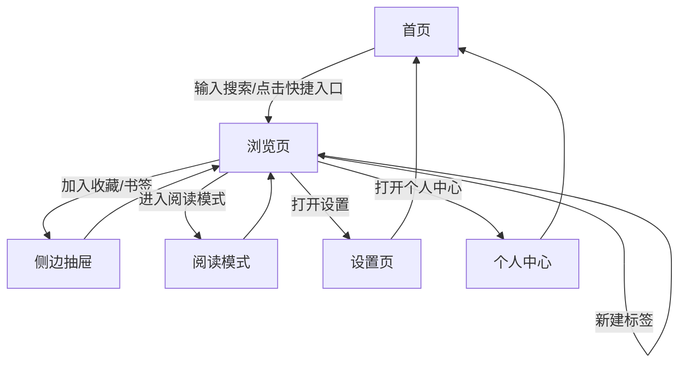

# Noir Web — 产品需求文档（PRD）

## 1. 产品概述

Noir Web 是原 Android 端「Noir 浏览器」的 Web 端重构版本，沿用「暗黑美学 + 流体微动效」的视觉语言，将移动端的搜索入口、多窗口浏览、书签/历史/收藏、阅读模式、设置等核心能力迁移到桌面浏览器中。
- **目标用户**：偏好极简暗黑风格、追求快速搜索与多任务浏览的桌面用户。
- **核心价值**：在一个页面里聚合多个常用搜索/内容站点入口，提供多标签浏览、本地化收藏与阅读模式，免登录即用。

## 2. 核心功能

### 2.1 用户角色

无需注册，所有访客均为匿名用户，数据保存在浏览器本地（localStorage）。

### 2.2 功能模块

1. **首页**：Logo 标题、搜索引擎选择、搜索框、快捷站点网格、底部导航。
2. **浏览页**：多标签 iframe 浏览、地址栏、前进/后退/刷新/首页、标签管理抽屉。
3. **书签 / 历史 / 收藏**：侧边抽屉，列表 + 搜索 + 删除。
4. **阅读模式**：粘贴 URL / 文本后提取正文，可切换字体大小与浅色/深色/护眼主题。
5. **设置页**：搜索引擎默认值、主题切换、广告拦截规则总开关（UI 演示）、清除数据。
6. **个人中心**：本地使用统计（打开标签数、收藏数、历史数），主题快速切换。

### 2.3 页面详情

| 页面名称 | 模块名称 | 功能描述 |
|---------|---------|---------|
| 首页 | 顶部品牌区 | Noir Logo + 副标题，渐入动画 |
| 首页 | 搜索区 | 搜索引擎下拉、输入框、回车/按钮触发，自动判断 URL 或搜索词 |
| 首页 | 快捷入口 | 11 个站点网格（百度/搜狗/必应/抖音/B站/知乎/优酷/爱奇艺/腾讯视频/豆包/千问），点击直达浏览页 |
| 首页 | 底部导航 | 主页 / 多窗口 / 收藏 / 我的 四个入口 |
| 浏览页 | 顶栏 | 返回 / 前进 / 刷新 / 地址栏 / 新建标签 / 阅读模式 |
| 浏览页 | 标签栏 | 横向标签列表，关闭/切换/新建 |
| 浏览页 | 内容区 | iframe 加载目标站点，加载进度条 |
| 浏览页 | 侧边抽屉 | 书签、历史、收藏三个面板 |
| 阅读模式 | 输入区 | URL/文本输入框，提取按钮 |
| 阅读模式 | 正文区 | 提取后展示，字号 + / -，主题切换 |
| 设置页 | 通用设置 | 默认搜索引擎、主题、广告拦截开关、数据清理 |
| 个人中心 | 统计卡 | 标签数 / 收藏数 / 历史数 / 使用时长 |

## 3. 核心流程

用户打开应用 → 在首页选择搜索引擎或点击快捷入口 → 输入关键词或网址 → 进入浏览页加载目标站点 → 可新建/切换标签，或将当前页加入收藏/书签 → 在阅读模式下提取正文阅读 → 在设置中调整偏好。

## 4. 用户界面设计

### 4.1 设计风格

- **主色**：深空黑 `#090d16` / 午夜蓝 `#0f172a` 作为底色，强调色采用霓虹品红 `#ec4899` + 电光青 `#38bdf8` 双色辅助。
- **次级色**：板岩灰 `#1e293b`、`#334155` 用于卡片与分隔；文字主色 `#f8fafc`，次级 `#94a3b8`。
- **按钮风格**：胶囊形大圆角（28px），悬停时微缩放 + 投影增强；主要按钮使用品红渐变。
- **字体**：标题使用 `Sora`（几何感、辨识度高），正文使用 `Manrope`（圆润可读），代码/数字使用 `JetBrains Mono`。
- **布局**：桌面端居中卡片式（最大宽 1200px），侧边抽屉滑入；移动端单列。
- **图标**：使用 `lucide-react` 线性图标，统一 1.5 描边。
- **氛围细节**：背景使用径向渐变 + 噪点纹理 + 模糊光斑（blur blobs），营造深邃质感。

### 4.2 页面设计概览

| 页面名称 | 模块名称 | UI 元素 |
|---------|---------|---------|
| 首页 | 顶部品牌区 | Logo 大字号渐变文字，副标题灰字，下落淡入动画 |
| 首页 | 搜索区 | 胶囊搜索框，左侧引擎图标 + 下拉，右侧搜索按钮，光晕聚焦 |
| 首页 | 快捷入口 | 4 列网格，圆形图标卡 + 标签，悬停上浮 + 边框发光 |
| 首页 | 底部导航 | 固定底部，4 个图标 + 文字，激活态用品红高亮 |
| 浏览页 | 顶栏 | 紧凑工具栏，地址栏占据中段，操作按钮统一 36px |
| 浏览页 | 标签栏 | 标签卡 160px 宽，激活态左侧品红竖条 |
| 浏览页 | 内容区 | 顶部 2px 进度条（品红渐变），加载完成后淡入 |
| 阅读模式 | 正文区 | 限宽 720px，行高 1.8，字号 18px 起，可调 |
| 设置页 | 列表 | 分组卡片，每行图标 + 标题 + 控件（开关/下拉） |

### 4.3 响应式

桌面优先（≥1024px 显示完整布局），平板（768-1023px）快捷入口变 3 列，移动端（<768px）单列堆叠、底部导航保留、抽屉全屏。

### 4.4 3D 场景

本项目不涉及 3D 场景。

