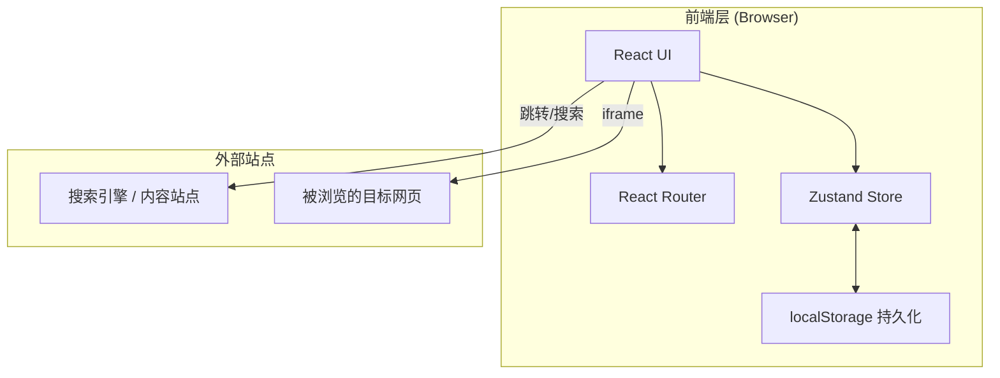
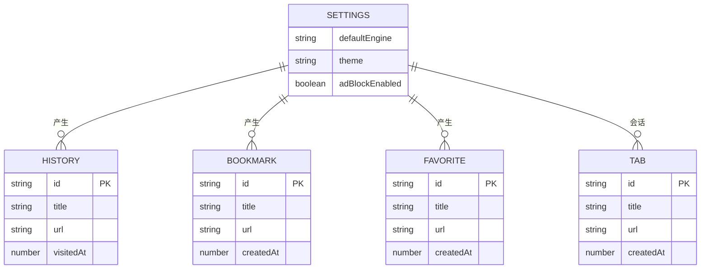

# Noir Web — 技术架构文档

## 1. 架构设计



纯前端架构，无后端服务。所有数据（书签、历史、收藏、设置、标签会话）通过 Zustand 管理 + localStorage 持久化。浏览目标站点使用 `<iframe>` 加载；若目标站点设置 `X-Frame-Options: DENY`，则提供「在新标签页打开」的回退按钮。

## 2. 技术说明

- **前端**：React 18 + TypeScript + Tailwind CSS 3 + Vite
- **路由**：react-router-dom v6
- **状态管理**：zustand（含 persist 中间件，自动同步 localStorage）
- **图标**：lucide-react
- **动效**：CSS 动画 + Framer Motion（页面切换/抽屉滑入）
- **初始化工具**：vite-init（react-ts 模板）
- **后端**：无
- **数据库**：无（使用浏览器 localStorage）

## 3. 路由定义

| 路由 | 用途 |
|------|------|
| `/` | 首页（搜索 + 快捷入口 + 底部导航） |
| `/browser` | 浏览页（多标签 iframe + 工具栏 + 抽屉） |
| `/reading` | 阅读模式（URL/文本输入 + 正文展示） |
| `/settings` | 设置页 |
| `/profile` | 个人中心 |

## 4. API 定义

无后端，无 API。所有数据通过本地存储模块 `src/store` 暴露的 hooks 访问：

```ts
// 搜索引擎
type Engine = { name: string; searchUrl: string; homeUrl: string; icon: string }

// 标签
type Tab = { id: string; title: string; url: string; favicon?: string; createdAt: number }

// 历史 / 书签 / 收藏
type HistoryItem = { id: string; title: string; url: string; visitedAt: number }
type Bookmark = { id: string; title: string; url: string; createdAt: number }
type Favorite = { id: string; title: string; url: string; createdAt: number }

// 设置
type Settings = {
  defaultEngine: string
  theme: 'dark' | 'light' | 'sepia'
  adBlockEnabled: boolean
}
```

## 5. 服务端架构

不适用（纯前端项目）。

## 6. 数据模型

### 6.1 数据模型定义



### 6.2 数据定义语言

不适用（使用 localStorage，以 JSON 字符串形式存储在以下键下）：

- `noir_settings` — 设置对象
- `noir_tabs` — 当前会话标签数组
- `noir_history` — 历史记录数组（最多 200 条，超出自动裁剪）
- `noir_bookmarks` — 书签数组
- `noir_favorites` — 收藏数组

## 7. 目录结构

```
src/
  components/        # 通用组件
    SearchBar.tsx
    QuickAccess.tsx
    BottomNav.tsx
    TabBar.tsx
    Drawer.tsx
    AddressBar.tsx
  pages/             # 路由页面
    Home.tsx
    Browser.tsx
    Reading.tsx
    Settings.tsx
    Profile.tsx
  store/             # zustand 状态
    useEngineStore.ts
    useTabsStore.ts
    useHistoryStore.ts
    useBookmarksStore.ts
    useFavoritesStore.ts
    useSettingsStore.ts
  data/              # 静态数据
    engines.ts
  utils/             # 工具函数
    url.ts
    readingParser.ts
  App.tsx
  main.tsx
  index.css
```

## 8. 与原 Android 项目的能力映射

| 原项目能力 | Web 端实现 | 备注 |
|-----------|-----------|------|
| MainActivity 搜索入口 | 首页 SearchBar | 一致 |
| 多窗口 BrowserActivity | Browser 页多标签 | iframe 替代 WebView |
| BookmarksFragment / HistoryFragment / FavoriteManager | 侧边抽屉 + zustand | localStorage 持久化 |
| ReadingModeActivity + ArticleParser | Reading 页 + readingParser | 客户端 DOM 解析 |
| SettingsActivity | Settings 页 | 一致 |
| ProfileActivity | Profile 页 | 本地统计 |
| AdBlock / DnsBlocker / ContentBlocker | 设置开关（演示） | 浏览器扩展能力，Web 端仅保留 UI |
| DownloadManager | 浏览器原生下载 | 由 `<a download>` 触发 |
| SpeedUp / WebAccelerator / DataCompressor | 不实现 | Web 端无对应能力 |
| VideoEnhance / PiPManager | 不实现 | 浏览器原生支持 PiP |
